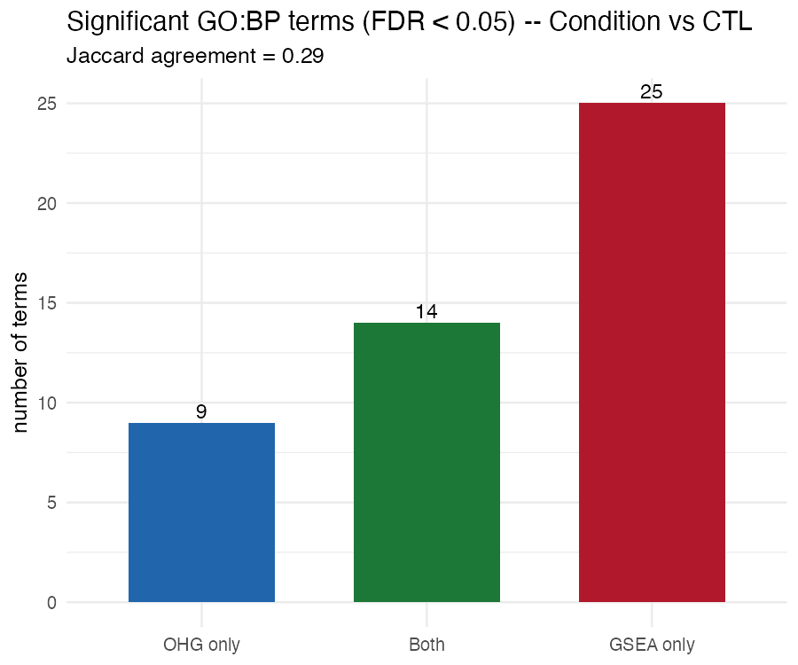
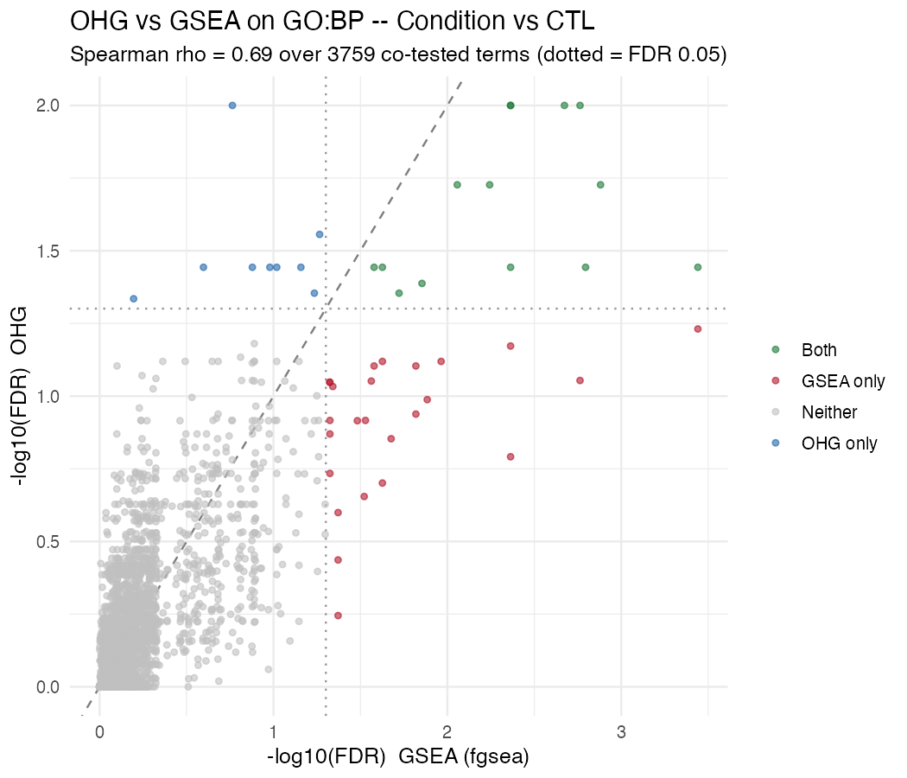
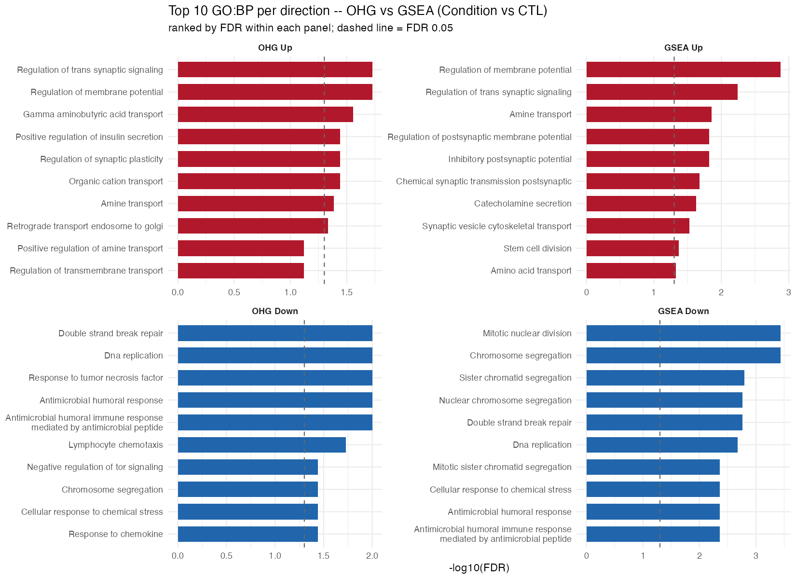
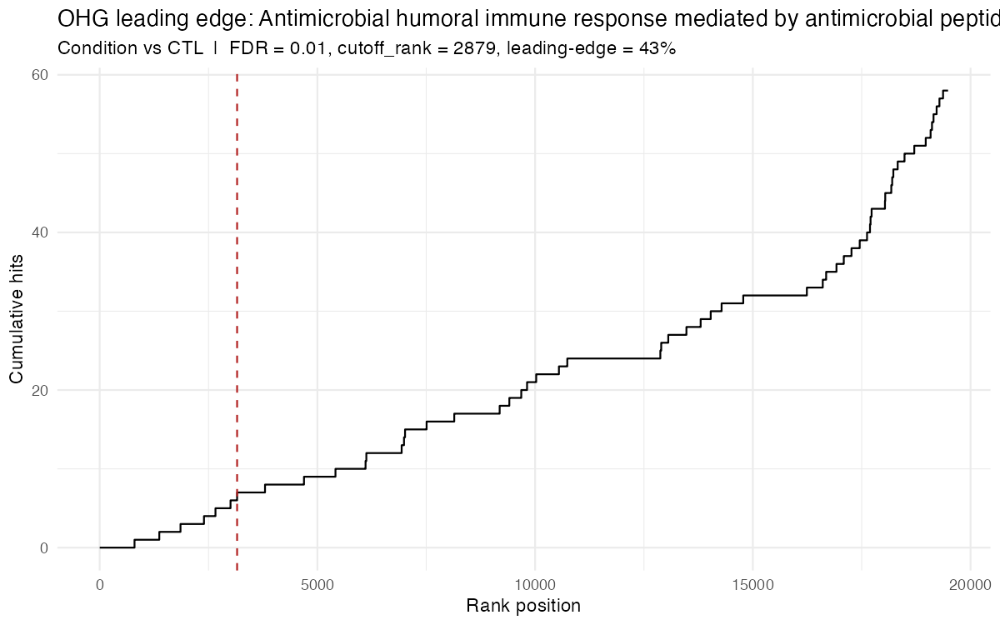

# OHG: Ordered Hypergeometric Enrichment

[](https://doi.org/10.5281/zenodo.20628295)

OHG takes a ranked gene list from a differential-expression analysis and finds which pathways are concentrated among your top genes. For each pathway it tells you whether that concentration is real, which genes form the leading edge that drives it, and how strongly those genes are differentially expressed — without asking you to choose a significance cutoff first.

It is built to sit alongside GSEA and over-representation analysis, not to replace them: the three ask different questions of the same ranked list, and where they agree you can trust the biology, where they differ you learn something about its shape.

---

# Quick start

## Install

```r
# install.packages("remotes")
remotes::install_github("MEladawi/OHG")
```

Optional extras, installed only if you need them: `ashr` (for `ohg_shrink_lfc()` fold-change shrinkage) and `future` + `furrr` (for parallel runs with `n_cores > 1`).

## Run

Start from a differential-expression table — a gene identifier, a log fold change, and a p-value per gene.

```r
library(OHG)

# 1. Rank the genes, most significant first, by signed significance.
de$rank_stat <- sign(de$log2FC) * -log10(de$pvalue)
de <- de[order(de$rank_stat, decreasing = TRUE), ]

# 2. Run OHG.
res <- ohg_enrichment(
  ranked_genes = de$gene,
  gene_sets    = "hallmark.gmt",        # a named list, a .gmt file, or a GeneSetCollection
  rank_stat    = de$rank_stat,          # orders the genes; its sign sets up- vs down-regulated
  weight       = abs(de$log2FC),        # the effect size behind the NLES column
  direction    = NULL,                  # NULL: inferred from the sign of rank_stat
  seed         = 1
)

# 3. Shortlist: keep what's significant, rank by effect size.
library(dplyr)
res |> filter(p_adjust < 0.05) |> arrange(desc(NLES_signed))
```

## Read the result

OHG turns a ranked list into ranked pathways through one pass:

```
ranked genes ──▶ scan every cutoff ──▶ optimal cutoff ──▶ leading-edge genes
                                                              │
                              permutation calibration ◀───────┘
                                          │
                                          ▼
                                 p_adjust (FDR) + NLES (effect size)
```

One row per pathway, most enriched first. The main columns:

| Column | Meaning |
|---|---|
| `p_adjust` | pathway significance (FDR-corrected) |
| `NLES` / `NLES_signed` | effect size — how strongly the leading-edge genes are regulated (unsigned / direction-signed) |
| `cutoff_rank` | the optimal cutoff (where the leading edge ends) |
| `leading_edge_fraction` | share of the pathway inside the leading edge (coverage) |
| `hits` | the leading-edge genes driving the signal |

The columns are deliberately separate readouts, answering three different questions:

| Question | Columns |
|---|---|
| **Is it enriched near the top?** | `p_value`, `p_adjust` |
| **Where does the signal sit, and which genes carry it?** | `cutoff_rank`, `leading_edge_fraction`, `hits` |
| **How strongly are those genes regulated, and in which direction?** | `NLES`, `NLES_signed` |

Significance (`p_adjust`) and effect size (`NLES`) are kept apart on purpose: a pathway can be highly significant on a modest effect or modestly significant on a large one, and a single combined number couldn't tell you which. `NLES_signed > 0` means the pathway is enriched among up-regulated genes, `< 0` among down-regulated. `leading_edge_fraction` is for interpreting a hit, not for ranking it.

## Sensible defaults

- **Rank genes** by `sign(log2FC) × −log10(p)`, or by any signed gene-level statistic you already have (a moderated-*t* or Wald *z* from limma/DESeq2 works directly).
- **Use the absolute log fold change** as the effect weight, regularized first — `ohg_shrink_lfc(log2FC, se)` when you have a standard error, otherwise `ohg_winsorize(log2FC)` — so noisy low-count genes don't dominate.
- **Pathways** can be a named list, a `.gmt` file (MSigDB, Enrichr, g:Profiler), or a `GSEABase::GeneSetCollection`.
- **Sharper or broader leading edges:** lower or raise `max_cutoff_frac` (default `0.25`).
- **Run in parallel:** set `n_cores > 1` (and `future::plan("multicore")` on Linux/HPC).

Helpers: `read_gmt()`, `ohg_shrink_lfc()`, `ohg_winsorize()`, `plot_ohg_leading_edge()`. See each function's help page (e.g. `?ohg_enrichment`) for the full argument and output reference.

---

---

# A real comparison: what OHG adds alongside GSEA

The following illustrates how the two methods behave on a single contrast — it is a demonstration of their different sensitivities, not a benchmark, and the method's justification (below) does not rest on it. We ran OHG and GSEA on the same ranked list from a postmortem cortical case–control contrast, with `direction = "both"` so that up- and down-regulated ends were tested together in one call (figures below). Of the pathways tested, 23 were significant by OHG and 39 by GSEA, with **14 significant by both — agreeing on direction in every one**. Those shared calls span the contrast's main biology: an immune/inflammatory program lowered in the condition (antimicrobial humoral response, lymphocyte and cell chemotaxis), a synaptic program raised (regulation of membrane potential, trans-synaptic signaling), and a genome-maintenance/cell-cycle program lowered (DNA replication, double-strand break repair, chromosome segregation). Two methods built on different statistics agreeing on this directional, multi-program picture is the reassurance that it is real rather than an artifact of either one.

On this dataset — 19,484 genes × 3,759 GO:BP gene sets (sizes 15–500) — the OHG run takes around 1.5 minutes on 8 cores. The permutation budget is adaptive: a baseline of `n_perm = 2000` for pathways far from significance, escalating to roughly 150,000 for near-significant pathways so their p-values resolve precisely.





The two methods are sensitive to different *enrichment architectures*, and the divergence below maps onto that.

**OHG was more sensitive to specific processes carried by a compact leading edge** — pathways whose signal is concentrated at the top of the ranking, where OHG's best-cutoff scan picks it up but GSEA's whole-list running sum spreads it thin:

| Pathway (OHG-only) | Direction | OHG `p_adjust` | GSEA `p_adjust` |
|---|---|---:|---:|
| response to tumor necrosis factor | down | 0.010 | 0.172 |
| GABA transport | up | 0.028 | 0.054 |
| response to chemokine | down | 0.036 | 0.132 |
| regulation of synaptic plasticity | up | 0.036 | 0.105 |
| negative regulation of TOR signaling | down | 0.036 | 0.096 |

This is what *more specific* means concretely. Instead of a generic "immune response," OHG names **response to tumor necrosis factor** and **response to chemokine**; instead of a generic "synaptic signaling," it names **regulation of synaptic plasticity** and **GABA transport**. And across OHG's significant pathways the leading edge averages ~29% of the pathway, so each call points to the compact gene subset driving it rather than the whole annotation — the `hits` column lists exactly those genes.

**GSEA, in turn, was more sensitive to broad programs spread thinly across many genes.** Its unique calls were dominated by one such program: about half (12 of 25) were cell-cycle and chromosome-machinery terms — mitotic nuclear division, sister chromatid segregation, organelle fission, centriole assembly — describing a single proliferation signal at many levels of granularity. OHG reported that program through its shared-core terms (DNA replication, chromosome segregation) without multiplying it into a dozen redundant children. (A broad cell-cycle signal in postmortem cortex can also track cell-type composition rather than biology — worth checking before interpretation.)

The practical takeaway: **run both.** Pathways called by both, in agreement, are the secure core. GSEA extends the picture toward broad, coordinated programs; OHG toward specific, concentrated ones — here neuroinflammatory (TNF, chemokine) and synaptic (plasticity, GABA) modules — and returns the leading-edge genes that carry each. The two are complementary, sensitive to different enrichment architectures, not competing.



> **Scope.** These observations come from this single contrast and are illustrative, not a benchmark — the method's justification rests on its design (below), not on this example. Comparisons on three independent differential-expression datasets from published manuscripts are in progress for verification and will be added here.

---

---

# Method and rationale

The rest of this document explains how OHG works and why each design choice is the right one for a real pathway analysis. The recurring theme: every choice is made to avoid either calling pathways that aren't there or missing the genes that matter.

## The problem with the usual approaches

When you have a differential-expression result, the two standard ways to ask "which pathways are involved" both throw away information you paid for.

Over-representation analysis (ORA — Enrichr, DAVID, g:Profiler) first splits your genes into a significant set and the rest, using a cutoff such as FDR < 0.05. Two costs follow. The cutoff is arbitrary — FDR < 0.05 versus < 0.10, with or without a fold-change filter, gives you a different gene list and different enriched pathways. And inside the significant set the ranking is gone: a gene that barely cleared the cutoff counts the same as your strongest hit, and everything below the cutoff counts for nothing.

GSEA keeps the ranking and is the right tool for many questions: its enrichment score is a weighted shift across the whole list, well suited to broad, coordinated, magnitude-driven signals. It simply asks a different question than OHG does — reading the whole list and weighting each gene by how far it moved, it measures overall displacement rather than whether a pathway's genes are specifically concentrated near the top.

OHG keeps the ranking and removes the cutoff. It walks down your ranked list, tries every possible cutoff, scores each one with a hypergeometric test, and keeps the most enriched. The genes above that cutoff are the **leading edge** — the part of the pathway actually driving the signal. This is the minimum-hypergeometric (mHG) idea (Eden et al., 2007, 2009). Because it searched many cutoffs and kept the best, that raw score is not yet a p-value; OHG then calibrates it (below) so the result is honest and comparable across pathways.

## Where OHG sits among ORA, GSEA, and itself

| Method | What it asks of your ranked list | Uses the ranking | Uses effect magnitude |
|---|---|---|---|
| ORA | Is the pathway over-represented in the set I cut out? | No | No |
| GSEA | Do the pathway's genes drift to one end, weighted by how much they moved? | Yes | Yes, inside the score |
| OHG | Are the pathway's genes packed near the top, and where exactly? | Yes | No in the test; reported separately as `NLES` |

Because the three test different questions, a pathway called by all of them is robust to how you analyze the data, and a pathway called by only one tells you which assumption it depends on. OHG's particular contribution to that trio is that it finds *coordinately concentrated* pathways and hands back the exact leading edge and a separate effect size.

## How OHG compares to other ordered-hypergeometric tools

The mHG idea is not new, but each existing tool gives you only part of a working pathway-analysis pipeline.

| Tool | Interface | mHG statistic | Calibrated p-value | Cutoff restriction | Effect-size column | Direction | Runs over a pathway collection | Custom sets / GMT |
|---|---|:--:|:--:|:--:|:--:|:--:|:--:|:--:|
| GOrilla (Eden et al., 2009) | Web | ✓ | Exact | — | — | — | GO only | — |
| `mHG` (CRAN) | R, one list | ✓ | Exact | — | — | — | — | — |
| `xlmhg` (Wagner, 2015) | Python | ✓ | Exact | ✓ (`X`, `L`) | — | — | — | — |
| ActivePathways | R / Bioconductor | ✓ | Lowest-p, then FDR across pathways | — | — | — | ✓ (multi-omics) | ✓ |
| OHG | R | ✓ | Calibrated per pathway | ✓ | ✓ (`NLES`) | ✓ | ✓ | ✓ |

GOrilla, `mHG`, and `xlmhg` compute the statistic and an exact p-value, but each tests a single ranked list — there is no table over a pathway collection, no effect size, and no up/down handling; `xlmhg` is Python and GOrilla is a Gene Ontology web tool. ActivePathways is the closest R workhorse and brought the ordered hypergeometric to multi-omics integration: it returns the minimum hypergeometric p-value observed during the scan together with the corresponding cutoff. OHG extends this framework by calibrating that scan statistic per pathway (a scan statistic — the minimum over many cutoffs — needs calibration before it behaves like a p-value that FDR correction can trust; see *Why OHG calibrates*), and by adding a leading-edge cutoff that stays concentrated, a separate effect-size axis, and direction — in one R pipeline that reads the gene-set formats you already use. The statistic itself is owed to Eden et al. (2007, 2009) and the `X`/`L` cutoff idea to Wagner (2015).

## Why OHG calibrates instead of reporting the best score

The score OHG finds is the most enriched point out of every cutoff it tried, so it always looks impressive — even for a pathway with no real signal, because it is the best of many overlapping tries. Taking that best-of-many score and calling it a p-value makes every pathway look more significant than it is, and your results fill with enrichments that aren't there. A downstream FDR correction does not rescue this: BH assumes each p-value going in is already honest, and feeding it inflated scores lets false pathways through at a rate well above the FDR you asked for. (This is exactly what happens when a lowest-of-the-search score is reported directly.)

OHG fixes this by asking the empirical question instead: shuffle the genes, run the identical cutoff search on random gene sets of the same size, and see how often random genes score as well as your pathway did. That fraction is the p-value, and because it was produced by the *same* procedure, it is honest and BH-correctable. The check that it works: on a randomly ordered list, OHG's p-values come out uniform.

**Why shuffling rather than an exact formula.** GOrilla and `xlmhg` get a calibrated p-value from an exact formula instead of shuffling. That formula is derived for the textbook version of the test — every gene a distinct cutoff, no limit on how deep the cutoff may go. OHG's test isn't the textbook version: it treats tied genes as one block and caps how deep the cutoff can sit (next sections). Shuffling automatically scores whatever the test actually does, ties and cap included, so calibration always matches the statistic; the exact formula would have to be re-derived to stay valid. Shuffling here is the correct choice, not a shortcut.

**Spending the shuffles where they matter.** Resolving a tiny p-value precisely takes many shuffles, and doing that for every pathway is wasteful when most will not survive FDR anyway. OHG draws a baseline number of shuffles for all pathways, then keeps shuffling only the pathways whose significant-or-not decision is still in doubt, stopping the rest early. This removes the floor that a fixed shuffle count imposes (you can't report a p below `1/(shuffles+1)`) exactly for the handful of pathways where resolution changes the answer, and spends almost nothing on the clear non-hits. The `n_perm_used` and `resolution_limited` columns record how many shuffles each pathway received and whether it was capped before resolving.

## Why the cutoff is restricted to the top of the list

Left to roam, the "most enriched cutoff" can land three-quarters of the way down your ranked list — technically the best hypergeometric point for a pathway whose genes are spread thinly, but a "leading edge" of several thousand genes tells you nothing about which genes matter. OHG caps how deep the cutoff can go (`max_cutoff_frac`, default the top 25% — the `L` idea from XL-mHG), so a leading edge stays a short, interpretable list. An optional floor (`min_hits`, the `X` idea) requires a few pathway genes in the leading edge before a cutoff counts, so one stray top-ranked gene can't carry a call. The shuffled background uses the same cap, so the p-value stays honest. This restriction is what keeps OHG's hits focused, and it is the main thing separating its calls from the broad, diffuse shifts that both an unrestricted scan and a magnitude-weighted score will report.

## The effect-size column (`NLES`), and why it uses the median

The hypergeometric test only counts genes — it asks how many of a pathway's genes are near the top, not how strongly they moved. So two pathways with the same leading edge get the same p-value even if one's genes barely changed and the other's changed dramatically. The **Normalized Leading-Edge Score (`NLES`)** adds that missing magnitude back as its own column. For each pathway, OHG summarizes the differential-expression magnitude of the leading-edge genes (by default the absolute log fold change) and standardizes it against the same summary from the shuffled gene sets:

```
NLES = [ median(|effect| of leading-edge genes) − median(|effect| of shuffled leading edges) ]
       / MAD(|effect| of shuffled leading edges)
```

**Why the median and MAD, not the mean and standard deviation.** Fold changes are dominated by a few genes with very large values, so an average-based score gets hijacked by outliers — a pathway can look weak just because one or two background genes had enormous fold changes, inflating the spread the score divides by. The median and the MAD (a robust spread) ignore those few extremes, so the score reflects the *typical* leading-edge gene rather than the loudest one. There is also a consistency reason: the observed number is a median, so it should be standardized against a median-based background, not a mean-based one. (Set `robust_nles = FALSE` if you need the mean/SD version to match another pipeline.)

`NLES` is reported on its own and never folded into the p-value or the FDR correction. This is the difference from a GSEA-style normalized enrichment score (NES): the NES *is* the significance statistic, normalized, so significance and magnitude move together. In OHG they are two independent readouts, because a pathway can be highly significant on a modest effect or modestly significant on a large one, and a single combined number cannot tell you which — so OHG keeps them apart and lets you combine them yourself when you build a shortlist. `NLES_signed` carries the up/down direction.

## Up, down, or both

OHG scans the top of whatever list you hand it, so `direction` points it at the end you care about: `"up"` uses the list as-is (most up-regulated genes), `"down"` reverses it (most down-regulated), and `"both"` does each end separately and corrects them together. Direction comes from the tested end and the sign of `rank_stat` — never from the sign of the effect weight, because the weight measures magnitude only, and letting it also encode direction would make `NLES` undefined for pathways whose leading edge mixes up- and down-regulated genes. The result is signed for you as `NLES_signed`. Leave `direction` unset and OHG infers it: a signed metric scans both ends, an all-positive one scans the top.

## The two inputs you supply: `rank_stat` and `weight`

They come from different columns of your DE table and do different jobs, and mixing them up is the one easy mistake.

`rank_stat` sets the order of the genes and, through its sign, splits them into up- and down-regulated; it is used for ties and direction and never enters the test itself. The recommended choice is **signed significance, `sign(log2FC) × −log10(p)`** — the p-value sets how far up a gene sits, the fold-change sign sets which end. Ranking this way keeps the ordering driven by *evidence* while leaving magnitude to `NLES`. Avoid a fold-change-weighted ranking such as `log2FC × −log10(p)`: it pulls the leading edge toward gene families that characteristically have big fold changes (cytokines, chemokines) and under-detects broad, coordinated, modest-effect programs — magnitude belongs in `NLES`, not in the ordering. Any signed gene-level statistic (a moderated-*t* or Wald *z*) works and stays finite even when p-values underflow.

`weight` is the per-gene effect size behind `NLES`; its magnitude is used and its sign ignored. The recommended choice is the **absolute log fold change**, regularized first so a low-count gene with a wild fold change doesn't dominate:

```r
clean_lfc <- if ("se" %in% names(de)) {
  ohg_shrink_lfc(de$log2FC, de$se)   # adaptive shrinkage (needs the 'ashr' package)
} else {
  ohg_winsorize(de$log2FC)           # caps the tails, no SE needed
}

res <- ohg_enrichment(
  ranked_genes = de$gene,
  gene_sets    = pathways,
  rank_stat    = sign(de$log2FC) * -log10(de$pvalue),
  weight       = abs(clean_lfc),
  seed         = 1
)
```

Regularize in your own script, not silently inside OHG — the core never transforms your weight, it only warns about clearly broken values, so what you did stays visible. (Build any `−log10(p)` term from finite p-values; OHG rejects non-finite weights.) `ohg_shrink_lfc()` uses `ashr`, which is an optional dependency (`Suggests`, not installed with OHG); install it with `install.packages("ashr")` to use shrinkage, or use `ohg_winsorize()`, which needs nothing extra.

## Turning the table into a shortlist

Gate on significance, then order by effect size:

```r
library(dplyr)
res |>
  filter(p_adjust < 0.05) |>
  arrange(desc(NLES_signed))
```

To see why a pathway was called, plot its leading edge — the running mHG curve down the ranking, with the chosen cutoff marked. A top-heavy curve is the visual signature of a concentrated signal:

```r
plot_ohg_leading_edge(res, pathway = "GOBP_RESPONSE_TO_TUMOR_NECROSIS_FACTOR")
```



Use `leading_edge_fraction` to read a hit, not to rank it. A low fraction with a high `NLES` is a strong driver sub-module of a large pathway; a high fraction with a low `NLES` is broad, gentle involvement. It is what keeps "pathway X is enriched" from being over-read as the whole pathway when the signal is really a handful of its genes — a distinction the p-value alone can't make.

## A few practical notes

**Ties.** Genes with the exact same `rank_stat` form a block whose internal order is arbitrary; OHG takes the whole block or none, so shuffling tied genes never changes the result. The cost is resolution — a metric with big tied blocks (raw `log2FC` with many repeats, or p-values all equal to 1) gives OHG few places to put the cutoff, while a continuous metric like `sign(log2FC) × −log10(p)` lets it place the leading edge precisely.

**When `NLES` is `NA`.** Sizing an effect needs enough spread in the shuffled background; for small or degenerate pathways OHG returns `NLES = NA` with a warning but keeps the pathway, with its p-value intact — "enriched, but too small to size the effect reliably."

**Big jobs.** Set `n_cores > 1` to shuffle in parallel. On Linux/HPC, `future::plan("multicore")` lets the workers share the large vectors instead of copying them; OHG uses whatever backend you set and never sets one itself. Results are identical across core counts for a fixed `seed`.

```r
res <- ohg_enrichment(de$gene, pathways, n_perm = 5000L, seed = 1, n_cores = 8L)
```

---

# Reference

## Inputs

| Input | Type | Notes |
|---|---|---|
| `ranked_genes` | character vector, ordered | Unique gene IDs, most significant first; this list is the background. |
| `gene_sets` | named list, `.gmt` path, or `GeneSetCollection` | Each pathway is intersected with `ranked_genes`, so `set_size` counts only genes present in your list. |
| `rank_stat` | numeric, aligned to `ranked_genes` | Non-increasing; sets ties and the inferred direction. Optional. |
| `weight` | numeric, aligned, finite | Per-gene effect magnitude for `NLES`; the absolute value is used. Optional. |

## Arguments of `ohg_enrichment()`

| Argument | Default | What it does |
|---|---|---|
| `ranked_genes`, `gene_sets` | required | Your ranked gene list and the pathways to test. |
| `rank_stat` | `NULL` | Values you ordered by; sets ties and the default direction. |
| `weight` | `NULL` | Effect magnitude behind `NLES`; `NULL` gives `NLES = NA`. |
| `direction` | `NULL` | `"up"`, `"down"`, `"both"`; inferred from the sign of `rank_stat` when `NULL`. |
| `max_cutoff_frac` | `0.25` | How deep the leading-edge cutoff may sit (the `L` restriction). |
| `min_hits` | `1` | Minimum pathway genes in the leading edge before a cutoff counts (the `X` restriction). |
| `p_adjust_method` | `"BH"` | Multiple-testing correction; any method in `stats::p.adjust.methods`. |
| `n_perm` | `2000` | Baseline shuffles; promising pathways are shuffled further as needed. |
| `n_perm_max` | (automatic) | Cap on shuffles per pathway. |
| `min_set_size` | `3` | Minimum pathway size to include; does not gate `NLES`. |
| `min_perm_nles` | `1000` | Minimum shuffles before `NLES` is reported. |
| `min_nles_support` | `10` | Minimum distinct background magnitudes before `NLES` is reported. |
| `robust_nles` | `TRUE` | `NLES` uses median/MAD (`TRUE`) or mean/SD (`FALSE`). |
| `collapse_both` | `FALSE` | With `"both"`, keep the stronger direction per pathway (with a factor-two penalty). |
| `method` | `"permutation"` | Calibration method. |
| `seed` | `NULL` | Reproducibility; your RNG state is restored afterward. |
| `n_cores` | `1` | Parallel workers; identical results across core counts for a fixed seed. |

## Output columns

One row per pathway (or pathway × direction), ordered by `p_value`:

| Column | Meaning |
|---|---|
| `pathway` | pathway name |
| `direction` | `"up"`/`"down"`, when reported |
| `set_size` | pathway genes present in your list |
| `cutoff_rank`, `leading_edge_size` | rank of the chosen cutoff |
| `overlap`, `n_leading_edge` | pathway genes in the leading edge |
| `leading_edge_fraction` | `overlap / set_size` (coverage) |
| `neg_log10_mHG`, `mHG_stat` | the raw mHG score (not a p-value) |
| `p_value`, `p_adjust` | calibrated significance, raw and corrected |
| `p_adjust_method` | the correction used |
| `n_perm_used`, `resolution_limited` | shuffles spent; `TRUE` if capped before resolving |
| `E_obs` | observed leading-edge magnitude (median absolute weight) |
| `NLES`, `NLES_signed` | effect size, unsigned and direction-signed |
| `hits` | leading-edge gene names |

---

## References

Eden E, Lipson D, Yogev S, Yakhini Z (2007). Discovering motifs in ranked lists of DNA sequences. *PLoS Computational Biology* 3(3):e39.

Eden E, Navon R, Steinfeld I, Lipson D, Yakhini Z (2009). GOrilla: a tool for discovery and visualization of enriched GO terms in ranked gene lists. *BMC Bioinformatics* 10:48.

Wagner F (2015). The XL-mHG test for enrichment: a technical report. *arXiv:1507.07905*.

Subramanian A, et al. (2005). Gene set enrichment analysis. *PNAS* 102(43):15545–15550.

Besag J, Clifford P (1991). Sequential Monte Carlo p-values. *Biometrika* 78(2):301–304.

## License

MIT © 2026 Mahmoud Eladawi.
